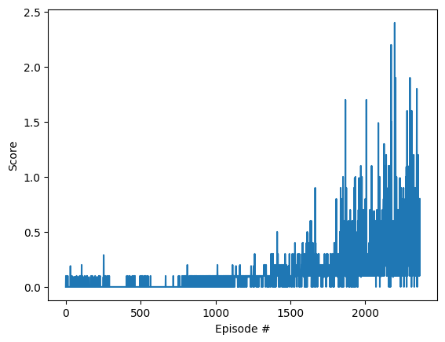

# Project 3: Collaboration and Competition - Report

### Learning Algorithm

The agents were trained using the **Multi-Agent Deep Deterministic Policy Gradient (MADDPG)** algorithm. MADDPG is an actor-critic, model-free algorithm that adapts the DDPG algorithm for use in a multi-agent environment. It is well-suited for environments with continuous action spaces where multiple agents must interact.

The key components of the implementation are:

-   **Actor-Critic Networks:** Each of the two agents has its own Actor and Critic network. The Actor network learns the policy (mapping states to actions), and the Critic network learns the action-value function (Q-value).

-   **Centralized Training with Decentralized Execution:** This is the core concept of MADDPG.
    -   *Decentralized Execution:* During gameplay, each agent's Actor selects an action using only its own local observation.
    -   *Centralized Training:* The Critic network for each agent is provided with the states and actions of *both* agents. This allows the Critic to learn a more stable value function by having a complete view of the environment, which helps to address the non-stationarity of the multi-agent setting.

-   **Shared Replay Buffer:** Experiences `(states, actions, rewards, next_states, dones)` from both agents are stored in a single, shared replay buffer. The agents learn by sampling random mini-batches from this buffer, which decorrelates experiences and stabilizes learning.

-   **Target Networks:** "Soft" updates are used for the target networks for both the Actor and Critic of each agent. This provides stable targets for the learning updates and improves convergence.

-   **Batched Learning Strategy:** To further improve stability, the agents perform 4 learning updates every 2 timesteps, rather than learning after every single step.

### Hyperparameters

The following hyperparameters were used for the final, successful training run:

| Hyperparameter  | Value  | Description                                  |
| --------------- | ------ | -------------------------------------------- |
| `BUFFER_SIZE`   | 1e6    | Replay buffer size                           |
| `BATCH_SIZE`    | 256    | Minibatch size                               |
| `GAMMA`         | 0.99   | Discount factor                              |
| `TAU`           | 1e-3   | For soft update of target parameters         |
| `LR_ACTOR`      | 3e-4   | Learning rate for the Actor                  |
| `LR_CRITIC`     | 1e-4   | Learning rate for the Critic                 |
| `WEIGHT_DECAY`  | 0      | L2 weight decay for the critic optimizer     |
| `NUM_UPDATES`   | 4      | Number of learning updates per learning step |
| `UPDATE_EVERY`  | 2      | Frequency of learning steps (in timesteps)   |

### Network Architectures

**Actor Network:**
-   **Input Layer:** 24 (State Size)
-   **Hidden Layer 1:** 256 units, ReLU activation
-   **Hidden Layer 2:** 128 units, ReLU activation
-   **Output Layer:** 2 (Action Size), Tanh activation

**Critic Network (Centralized):**
-   **Input Layer (State & Action Pathway):** (24 + 2) * 2 = 52 units, taking states and actions from both agents.
-   **Hidden Layer 1:** 256 units, ReLU activation
-   **Hidden Layer 2:** 128 units, ReLU activation
-   **Output Layer:** 1 (Q-Value)

### Plot of Rewards

The environment was solved in **2265 episodes**, reaching an average score of +0.501 over 100 consecutive episodes. The plot below shows the score per episode.

### Ideas for Future Work

While the MADDPG agent was successful, further improvements could be explored:

-   **Prioritized Experience Replay (PER):** Instead of uniform sampling, PER would allow the agents to learn more frequently from experiences that were particularly surprising or informative, which could speed up learning.
-   **Different Noise Process:** The Ornstein-Uhlenbeck process was used for exploration. Experimenting with a simpler, uncorrelated Gaussian noise, potentially with a decaying schedule, could offer a different exploration-exploitation balance.
-   **More Advanced Algorithms:** Implementing more modern multi-agent algorithms like MAPPO (Multi-Agent PPO) could lead to even more stable training and potentially a faster solution.
-   **Hyperparameter Tuning:** A more systematic search (e.g., grid search) for hyperparameters like learning rates, batch size, and the learning update frequency could potentially find an even more optimal and faster configuration.
