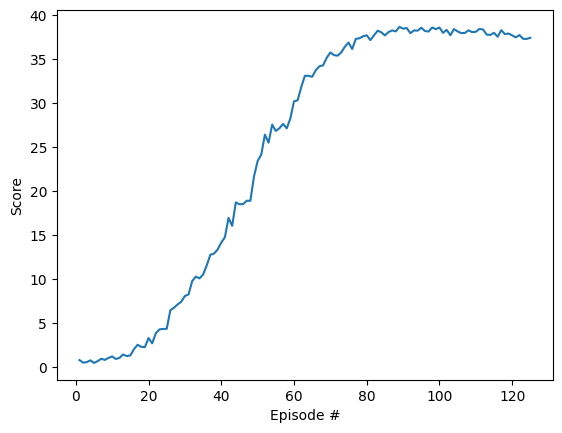

# Project 2: Continuous Control - Report

### Learning Algorithm

The agent was trained using the Deep Deterministic Policy Gradient (DDPG) algorithm. DDPG is an actor-critic, model-free algorithm well-suited for continuous action spaces. It combines ideas from Deep Q-Networks (DQN) with traditional actor-critic methods.

The key components of the implementation are:
- **Actor-Critic Networks:** Two separate neural networks are used. The Actor network learns the policy (mapping states to actions), and the Critic network learns the action-value function (Q-value).
- **Replay Buffer:** Experiences `(state, action, reward, next_state, done)` are stored in a replay buffer. The agent learns by sampling random mini-batches from this buffer, which decorrelates experiences and stabilizes the learning process.
- **Target Networks:** "Soft" updates are used for the target networks for both the actor and critic. This provides stable targets for the learning updates and improves convergence.
- **Multi-Agent Learning:** The implementation was adapted to use the 20-agent environment. This enables parallel experience gathering, resulting in more diverse data in the replay buffer and faster, more stable training.
- **Batched Learning Strategy:** To further improve stability, the agent performs 10 learning updates every 20 timesteps, rather than learning after every single step.

#### Hyperparameters

The following hyperparameters were used for the final, successful training run:

| Hyperparameter      | Value   | Description                               |
| ------------------- | ------- | ----------------------------------------- |
| `BUFFER_SIZE`       | 1e6     | Replay buffer size                        |
| `BATCH_SIZE`        | 256     | Minibatch size                            |
| `GAMMA`             | 0.99    | Discount factor                           |
| `TAU`               | 1e-3    | For soft update of target parameters      |
| `LR_ACTOR`          | 1e-4    | Learning rate of the actor                |
| `LR_CRITIC`         | 3e-4    | Learning rate of the critic               |
| `WEIGHT_DECAY`      | 0       | L2 weight decay for the critic optimizer  |

#### Network Architectures

**Actor Network:**
- **Input Layer:** 33 (State Size)
- **Hidden Layer 1:** 400 units, ReLU activation
- **Hidden Layer 2:** 300 units, ReLU activation
- **Output Layer:** 4 (Action Size), Tanh activation

**Critic Network:**
- **Input Layer (State Pathway):** 33 (State Size)
- **Hidden Layer 1:** 400 units, ReLU activation
- **Hidden Layer 2 (with Action Pathway):** 300 units, ReLU activation
- **Output Layer:** 1 (Q-Value)

### Plot of Rewards

The environment was solved in **25 episodes**, reaching an average score of +30.19 over 100 consecutive episodes. The plot below shows the score per episode.

### Ideas for Future Work

While the DDPG agent was successful, further improvements could be explored:
- **Prioritized Experience Replay (PER):** Instead of uniform sampling, PER would allow the agent to learn more frequently from experiences that were particularly surprising or informative, which could speed up learning.
- **Different Algorithms:** Implementing more modern algorithms like Proximal Policy Optimization (PPO) or Twin Delayed DDPG (TD3) could lead to even faster and more stable training.
- **Hyperparameter Tuning:** A more systematic search (e.g., grid search) for hyperparameters like learning rates or the learning update frequency could potentially find an even more optimal configuration.
